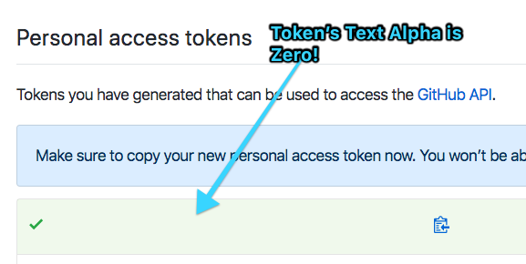

# Token Hider Chrome Extension

## How it Works

This plugin injects CSS to change font colors to 0:

For example, here is the CSS injected into Github:

```css
code#new-oauth-token {
  color: rgba(0, 0, 0, 0) !important;
}
```



## Warning

This only supports sites listed in the `manifest.json`. Please
submit a PR to add more sites!

## Adding a Site

1. Open at `manifest.json`
2. Copy/paste a content_scripts object
3. Customize to your URL and CSS needs

## Install

```
1. git clone
2. Open chrome://extensions/
3. Toggle "Developer mode"
4. "Load unpacked extension" and select this directory
```
